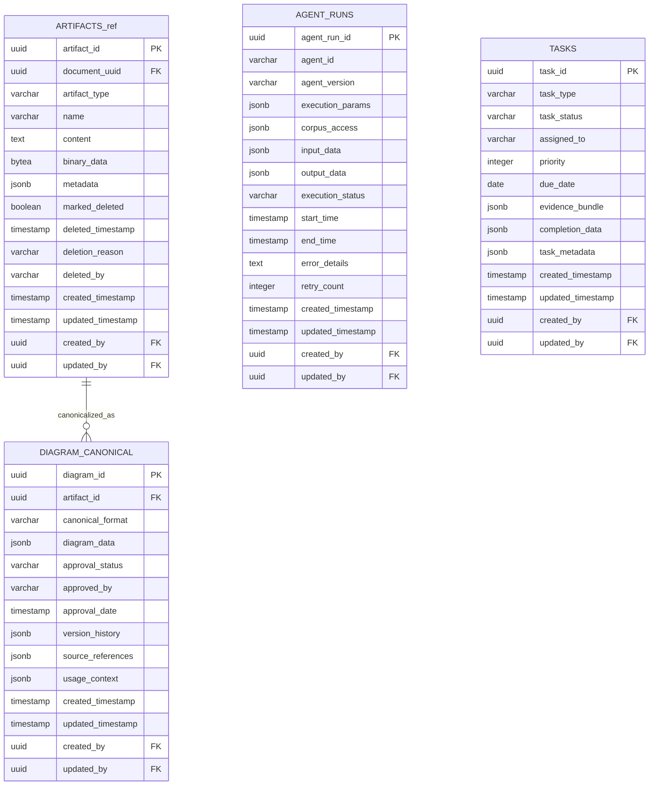

# ER Diagram - Agent & Task Management

## Purpose

Human-in-the-loop workflow orchestration. Tracks AI agent execution with corpus access controls, creates structured human review tasks when automation cannot proceed, and manages canonical diagram approval workflows for patent analysis.

## Agent & Task Management Domain

## Referenced Tables Legend
- **ARTIFACTS_ref** → **ARTIFACTS** (Document Management domain) - Referenced for diagram canonicalization relationships

---
**VISUAL AUTHORITY** - Enhanced ER representation | **Implementation**: [database.py](../src/app/models/database.py) | **Requirements**: [DatabaseSchemaSpec.md](../design/DatabaseSchemaSpec.md), [LoggingAndEventsSpec.md](../design/LoggingAndEventsSpec.md) | **Updated**: January 7, 2026

## Cross-Domain Relationships

**To System Foundation domain:**
- `AGENT_RUNS.created_by` → `USERS.user_id`
- `AGENT_RUNS.updated_by` → `USERS.user_id`
- `TASKS.created_by` → `USERS.user_id`
- `TASKS.updated_by` → `USERS.user_id`
- `DIAGRAM_CANONICAL.created_by` → `USERS.user_id`
- `DIAGRAM_CANONICAL.updated_by` → `USERS.user_id`

**To Document Management domain:**
- `DIAGRAM_CANONICAL.artifact_id` → `ARTIFACTS.artifact_id`

## Domain Tables (3 + 1 referenced)

1. **`AGENT_RUNS`** - Agent execution tracking and performance metrics
2. **`TASKS`** - HITL task lifecycle and evidence bundle management
3. **`DIAGRAM_CANONICAL`** - Canonical diagram representations with approval workflow
4. **`ARTIFACTS`** (referenced) - Document artifacts from Document Management domain

## Key Features

- **Agent Execution**: Complete lifecycle tracking with performance metrics
- **HITL Workflows**: Human-in-the-loop task management with evidence bundles
- **Content Canonicalization**: Formal approval process for diagram content
- **Error Handling**: Retry logic and detailed error tracking for agent runs

## Management Workflow

1. Agents execute tasks with tracked parameters and performance
2. HITL tasks are created for human validation and intervention
3. Artifacts are canonicalized through formal approval processes
4. All activities are tracked with comprehensive audit trails

---

**Last Updated**: January 7, 2026  
**Domain Tables**: 3 management tables + 1 referenced  
**Status**: Agent orchestration and task coordination

---
**VISUAL AUTHORITY** | **Implementation**: [database.py](../src/app/models/database.py) | **Requirements**: [DatabaseSchemaSpec.md](../design/DatabaseSchemaSpec.md), [LoggingAndEventsSpec.md](../design/LoggingAndEventsSpec.md)