# ER Diagram - Audit & Logging System

## Purpose

Litigation-grade audit trails and provenance tracking. Captures immutable event logs for compliance, maintains complete data lineage chains for patent intelligence decisions, and supports forensic analysis of system operations.

## Audit & Logging System Domain

```mermaid
%%{init: {"securityLevel": "loose"}}%%
erDiagram
    %% Referenced table (from Agent & Task Management domain)
    TASKS_ref {
        uuid task_id PK
        varchar task_type
        varchar task_status
        varchar assigned_to
        integer priority
        date due_date
        jsonb evidence_bundle
        jsonb completion_data
        jsonb task_metadata
        timestamp created_timestamp
        timestamp updated_timestamp
        uuid created_by FK
        uuid updated_by FK
    }
    
    %% Audit & Logging System Tables
    AUDIT_EVENTS {
        uuid audit_event_id PK
        varchar event_type
        varchar event_name
        text event_descript
        varchar actor_type
        varchar actor_id
        varchar actor_name
        varchar session_id
        varchar resource_type
        varchar resource_id
        varchar resource_name
        varchar action_taken
        text action_rationale
        jsonb before_state
        jsonb after_state
        varchar request_id
        varchar correlation_id
        varchar trace_id
        timestamp event_timestamp
        varchar timezone
        varchar dev_phase
        varchar ruleset_version
        varchar enforcement_mode
        jsonb affected_res
        varchar impact_level
        boolean requires_hitl
        uuid hitl_task_id FK
        jsonb additional_ctx
        varchar source_system
        timestamp created_timestamp
        timestamp updated_timestamp
        uuid created_by FK
        uuid updated_by FK
    }
    
    PIPELINE_EVENT_LOGS {
        uuid event_log_id PK
        uuid audit_event_id FK
        varchar event_id
        varchar event_type
        integer priority
        varchar source
        timestamp event_timestamp
        varchar document_id
        varchar image_id
        varchar batch_id
        varchar user_id
        jsonb payload
        boolean delivered
        integer delivery_attempt
        timestamp last_delivery
        jsonb delivery_errors
        timestamp created_timestamp
        timestamp updated_timestamp
        uuid created_by FK
        uuid updated_by FK
    }
    
    PIPELINE_OVERRIDE_AUDITS {
        uuid override_audit_id PK
        varchar override_id
        uuid administrator_id FK
        varchar admin_role
        varchar admin_ip
        varchar action
        varchar reason_category
        text justification
        timestamp requested_at
        timestamp executed_at
        timestamp completed_at
        jsonb context
        jsonb metadata
        boolean success
        text error_message
        boolean rollback_done
        uuid audit_event_id FK
        timestamp created_timestamp
        timestamp updated_timestamp
        uuid created_by FK
        uuid updated_by FK
    }
    
    PROVENANCE_RECORDS {
        uuid provenance_record_id PK
        uuid source_art_id
        uuid derived_art_id
        varchar transform_type
        jsonb transform_detail
        varchar processing_agent
        decimal confidence_score
        timestamp created_timestamp
        timestamp updated_timestamp
        uuid created_by FK
        uuid updated_by FK
    }
    
    %% Domain Relationships
    TASKS_ref ||--o{ AUDIT_EVENTS : triggers
    AUDIT_EVENTS ||--o{ PIPELINE_EVENT_LOGS : logged_as
    AUDIT_EVENTS ||--o{ PIPELINE_OVERRIDE_AUDITS : overridden_by
```

## Referenced Tables Legend
- **TASKS_ref** → **TASKS** (Agent & Task Management domain) - Source tasks that trigger audit events

## Cross-Domain Relationships

**To System Foundation domain:**
- `AUDIT_EVENTS.created_by` → `USERS.user_id`
- `AUDIT_EVENTS.updated_by` → `USERS.user_id`
- `PIPELINE_EVENT_LOGS.created_by` → `USERS.user_id`
- `PIPELINE_EVENT_LOGS.updated_by` → `USERS.user_id`
- `PIPELINE_OVERRIDE_AUDITS.administrator_id` → `USERS.user_id`
- `PIPELINE_OVERRIDE_AUDITS.created_by` → `USERS.user_id`
- `PIPELINE_OVERRIDE_AUDITS.updated_by` → `USERS.user_id`
- `PROVENANCE_RECORDS.created_by` → `USERS.user_id`
- `PROVENANCE_RECORDS.updated_by` → `USERS.user_id`

**To Agent & Task Management domain:**
- `AUDIT_EVENTS.hitl_task_id` → `TASKS.task_id`

**Internal domain relationships:**
- `PIPELINE_EVENT_LOGS.audit_event_id` → `AUDIT_EVENTS.audit_event_id`
- `PIPELINE_OVERRIDE_AUDITS.audit_event_id` → `AUDIT_EVENTS.audit_event_id`

## Domain Tables (4 + 1 referenced)

1. **`AUDIT_EVENTS`** - Primary audit event logging (immutable)
2. **`PIPELINE_EVENT_LOGS`** - Operational pipeline event correlation
3. **`PIPELINE_OVERRIDE_AUDITS`** - Administrative override tracking
4. **`PROVENANCE_RECORDS`** - Lineage and transformation tracking
5. **`TASKS`** (referenced) - HITL tasks from Agent & Task Management domain

## Key Features

- **Immutable Audit Trail**: Complete system activity logging with correlation IDs
- **Pipeline Integration**: Operational event correlation with delivery tracking
- **Administrative Oversight**: Override actions with justification requirements
- **Content Lineage**: Transformation and derivation tracking with confidence

## Audit Workflow

1. System events are captured in immutable audit logs
2. Pipeline events correlate operational activities with audit events
3. Administrative overrides are tracked with full justification
4. Content transformations maintain provenance chains

---

**Last Updated**: January 7, 2026  
**Domain Tables**: 4 audit tables + 1 referenced  
**Status**: Comprehensive audit and compliance framework

---
**VISUAL AUTHORITY** | **Implementation**: [database.py](../src/app/models/database.py) | **Requirements**: [LoggingAndEventsSpec.md](../design/LoggingAndEventsSpec.md), [DatabaseSchemaSpec.md](../design/DatabaseSchemaSpec.md)