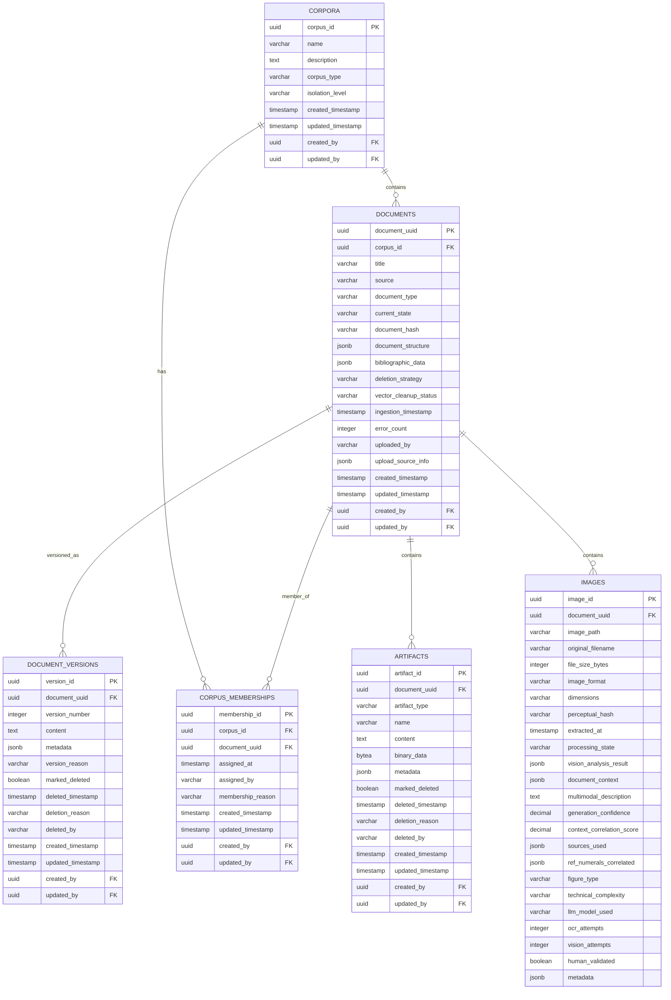

# ER Diagram - Document Management & Storage

## Purpose

Document ingestion pipeline with corpus-based access control. Tracks documents from upload through processing states, maintains immutable version history, extracts artifacts (text, images, diagrams), and enforces strict corpus isolation for patent intelligence workflows.

## Document Management & Storage Domain

## Cross-Domain Relationships

All tables in this domain have audit field foreign keys to the System Foundation domain:
- `*.created_by` → `USERS.user_id` (System Foundation domain)
- `*.updated_by` → `USERS.user_id` (System Foundation domain)

## Domain Tables (6 total)

1. **`CORPORA`** - Corpus definitions and isolation policies
2. **`DOCUMENTS`** - Primary document entities with enhanced metadata
3. **`DOCUMENT_VERSIONS`** - Immutable version history with soft delete
4. **`CORPUS_MEMBERSHIPS`** - Document-to-corpus assignment tracking
5. **`ARTIFACTS`** - Document-derived content (text, images, diagrams)
6. **`IMAGES`** - Enhanced image metadata with multimodal analysis

## Key Features

- **Corpus Isolation**: Document-to-corpus assignment via memberships table
- **Version Control**: Immutable version history with soft delete capabilities
- **Content Management**: Structured storage for documents, artifacts, and images
- **Metadata Rich**: JSONB fields for flexible document structure and context

---

**Last Updated**: January 7, 2026  
**Domain Tables**: 6 tables  
**Status**: Core document management foundation

---
**VISUAL AUTHORITY** | **Implementation**: [database.py](../src/app/models/database.py) | **Requirements**: [DatabaseSchemaSpec.md](../design/DatabaseSchemaSpec.md), [CorpusRequirements.md](../proposals/CorpusDesign/CorpusRequirements.md)