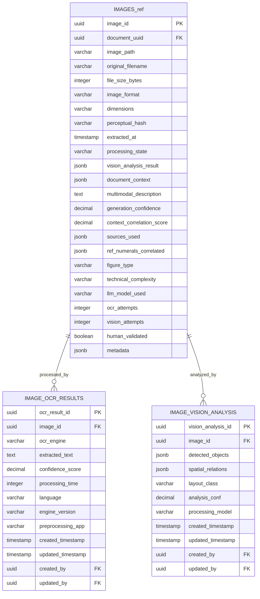

# ER Diagram - Multimodal Processing

## Purpose

Image analysis pipeline extracting visual content from patent documents. Performs OCR on diagrams/figures, generates LLM-based descriptions of technical imagery, and creates searchable text representations of visual patent elements.

## Multimodal Processing Domain

## Referenced Tables Legend
- **IMAGES_ref** → **IMAGES** (Document Management domain) - Source images for multimodal processing

## Cross-Domain Relationships

**To System Foundation domain:**
- `IMAGE_OCR_RESULTS.created_by` → `USERS.user_id`
- `IMAGE_OCR_RESULTS.updated_by` → `USERS.user_id`
- `IMAGE_VISION_ANALYSIS.created_by` → `USERS.user_id`
- `IMAGE_VISION_ANALYSIS.updated_by` → `USERS.user_id`

**To Document Management domain:**
- `IMAGE_OCR_RESULTS.image_id` → `IMAGES.image_id`
- `IMAGE_VISION_ANALYSIS.image_id` → `IMAGES.image_id`

## Domain Tables (2 + 1 referenced)

1. **`IMAGE_OCR_RESULTS`** - OCR extraction results with confidence scoring
2. **`IMAGE_VISION_ANALYSIS`** - Vision model analysis with spatial relationships
3. **`IMAGES`** (referenced) - Image metadata from Document Management domain

## Key Features

- **OCR Processing**: Multi-engine text extraction with confidence metrics
- **Vision Analysis**: Object detection and spatial relationship analysis
- **Performance Tracking**: Processing times and engine version tracking
- **Quality Assurance**: Confidence scoring and human validation workflows

## Processing Workflow

1. Images are stored in the Document Management domain
2. OCR engines extract text content with confidence scoring
3. Vision models analyze visual content and spatial relationships
4. Results are correlated with document context for multimodal understanding

---

**Last Updated**: January 7, 2026  
**Domain Tables**: 2 processing tables + 1 referenced  
**Status**: Multimodal content analysis pipeline

---
**VISUAL AUTHORITY** | **Implementation**: [database.py](../src/app/models/database.py) | **Requirements**: [DatabaseSchemaSpec.md](../design/DatabaseSchemaSpec.md), [CorpusRequirements.md](../proposals/CorpusDesign/CorpusRequirements.md)