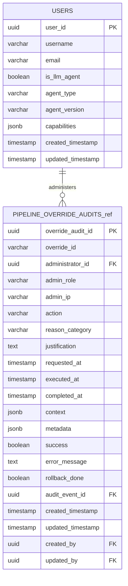

# ER Diagram - System Foundation

## Purpose

Core identity and access management without authentication. Provides simple reviewer identification for human-in-the-loop tasks and audit attribution in a single-user patent analysis environment.

## System Foundation Domain

## Referenced Tables Legend
- **PIPELINE_OVERRIDE_AUDITS_ref** → **PIPELINE_OVERRIDE_AUDITS** (Audit & Logging domain) - Shows administrative relationship to users

## Cross-Domain Relationships

**From System Foundation domain (USERS table provides identity for all other domains):**

**To Document Management domain:**
- All tables: `*.created_by` ← `USERS.user_id`
- All tables: `*.updated_by` ← `USERS.user_id`

**To Multimodal Processing domain:**
- `IMAGE_OCR_RESULTS.created_by` ← `USERS.user_id`
- `IMAGE_OCR_RESULTS.updated_by` ← `USERS.user_id`
- `IMAGE_VISION_ANALYSIS.created_by` ← `USERS.user_id`
- `IMAGE_VISION_ANALYSIS.updated_by` ← `USERS.user_id`

**To Agent & Task Management domain:**
- `AGENT_RUNS.created_by` ← `USERS.user_id`
- `AGENT_RUNS.updated_by` ← `USERS.user_id`
- `TASKS.created_by` ← `USERS.user_id`
- `TASKS.updated_by` ← `USERS.user_id`
- `DIAGRAM_CANONICAL.created_by` ← `USERS.user_id`
- `DIAGRAM_CANONICAL.updated_by` ← `USERS.user_id`

**To Vector Operations domain:**
- `VECTOR_CLEANUP_AUDIT.created_by` ← `USERS.user_id`
- `VECTOR_CLEANUP_AUDIT.updated_by` ← `USERS.user_id`
- `VECTOR_RESTORATION_CACHE.created_by` ← `USERS.user_id`
- `VECTOR_RESTORATION_CACHE.updated_by` ← `USERS.user_id`

**To Audit & Logging domain:**
- All audit tables: `*.created_by` ← `USERS.user_id`
- All audit tables: `*.updated_by` ← `USERS.user_id`
- `PIPELINE_OVERRIDE_AUDITS.administrator_id` ← `USERS.user_id`

**To Audit & Logging domain (referenced table):**
- `PIPELINE_OVERRIDE_AUDITS.administrator_id` → `USERS.user_id`
- `PIPELINE_OVERRIDE_AUDITS.audit_event_id` → `AUDIT_EVENTS.audit_event_id`

## Domain Tables (1 + 1 referenced)

1. **`USERS`** - Enhanced user/agent identity with LLM agent tracking
2. **`PIPELINE_OVERRIDE_AUDITS`** (referenced) - Administrative actions from Audit & Logging domain

## Key Features

- **Unified Identity**: Single table for both human users and LLM agents
- **Agent Capabilities**: JSONB field for flexible agent capability definitions
- **Administrative Tracking**: Connection to override audit system
- **Foundation Support**: Referenced by all other domains via audit fields

## Cross-Domain Integration

The USERS table serves as the foundation for all system audit trails through standardized `created_by` and `updated_by` fields across all domains:

- **Document Management**: All document operations tracked to users
- **Multimodal Processing**: OCR and vision analysis attributed to processing agents
- **Agent & Task Management**: Agent runs and task assignments linked to users
- **Vector Operations**: Cleanup and cache operations audited to users
- **Audit & Logging**: All audit events attributed to actor users/agents

---

**Last Updated**: January 7, 2026  
**Domain Tables**: 1 foundation table + 1 referenced  
**Status**: Core identity and audit accountability foundation

---
**VISUAL AUTHORITY** | **Implementation**: [database.py](../src/app/models/database.py) | **Requirements**: [DatabaseSchemaSpec.md](../design/DatabaseSchemaSpec.md), [LoggingAndEventsSpec.md](../design/LoggingAndEventsSpec.md)