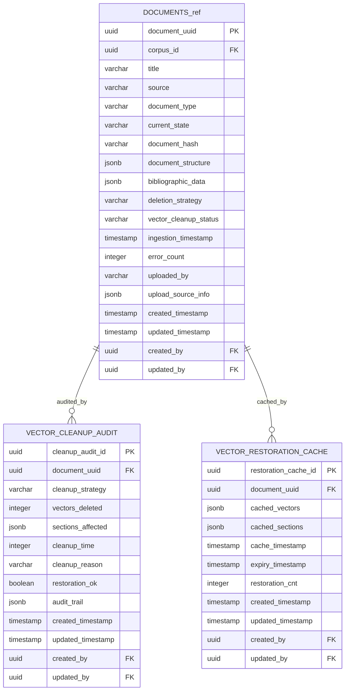

# ER Diagram - Vector & Cache Operations

## Purpose

Vector cleanup and data restoration infrastructure. Audits vector database cleanup operations and maintains restoration caches for recovering cleaned data when needed, supporting large-scale patent document vector operations.

## Vector & Cache Operations Domain

## Referenced Tables Legend
- **DOCUMENTS_ref** → **DOCUMENTS** (Document Management domain) - Source documents for vector operations

## Cross-Domain Relationships

**To System Foundation domain:**
- `VECTOR_CLEANUP_AUDIT.created_by` → `USERS.user_id`
- `VECTOR_CLEANUP_AUDIT.updated_by` → `USERS.user_id`
- `VECTOR_RESTORATION_CACHE.created_by` → `USERS.user_id`
- `VECTOR_RESTORATION_CACHE.updated_by` → `USERS.user_id`

**To Document Management domain:**
- `VECTOR_CLEANUP_AUDIT.document_uuid` → `DOCUMENTS.document_uuid`
- `VECTOR_RESTORATION_CACHE.document_uuid` → `DOCUMENTS.document_uuid`

## Domain Tables (2 + 1 referenced)

1. **`VECTOR_CLEANUP_AUDIT`** - Vector lifecycle management and cleanup tracking
2. **`VECTOR_RESTORATION_CACHE`** - Cached vector data for restoration operations
3. **`DOCUMENTS`** (referenced) - Document entities from Document Management domain

## Key Features

- **Cleanup Auditing**: Complete tracking of vector deletion operations
- **Restoration Cache**: Performance optimization for vector recovery
- **Strategy Tracking**: Different cleanup approaches with success metrics
- **Time Management**: Cache expiry and restoration count tracking

## Operations Workflow

1. Documents undergo vector cleanup with strategy-based deletion
2. Cleanup operations are fully audited with affected sections tracked
3. Vector data is cached for potential restoration needs
4. Cache expiry ensures optimal storage utilization

---

**Last Updated**: January 7, 2026  
**Domain Tables**: 2 operations tables + 1 referenced  
**Status**: Vector lifecycle optimization

---
**VISUAL AUTHORITY** | **Implementation**: [database.py](../src/app/models/database.py) | **Requirements**: [DatabaseSchemaSpec.md](../design/DatabaseSchemaSpec.md)