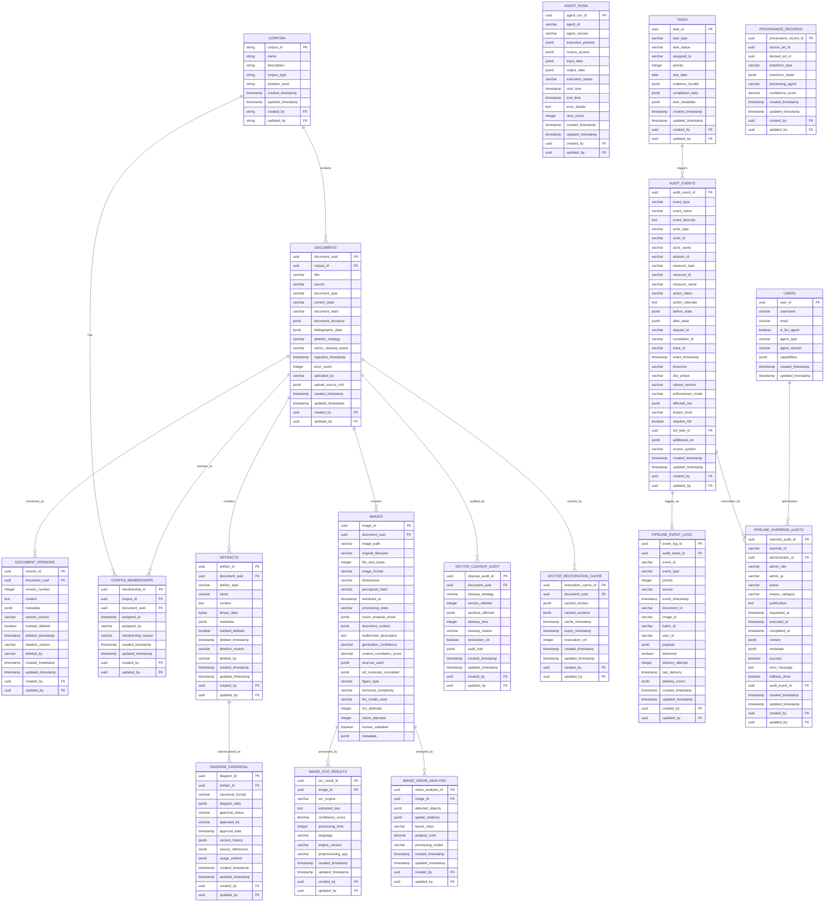

```mermaid
%%{init: {"securityLevel": "loose"}}%%
erDiagram
    %% Core Document Management
    CORPORA {
        string corpus_id PK
        string name
        string description
        string corpus_type
        string isolation_level
        timestamp created_timestamp
        timestamp updated_timestamp
        string created_by FK
        string updated_by FK
    }
    
    DOCUMENTS {
        uuid document_uuid PK
        uuid corpus_id FK
        varchar title
        varchar source
        varchar document_type
        varchar current_state
        varchar document_hash
        jsonb document_structure
        jsonb bibliographic_data
        varchar deletion_strategy
        varchar vector_cleanup_status
        timestamp ingestion_timestamp
        integer error_count
        varchar uploaded_by
        jsonb upload_source_info
        timestamp created_timestamp
        timestamp updated_timestamp
        uuid created_by FK
        uuid updated_by FK
    }
    
    DOCUMENT_VERSIONS {
        uuid version_id PK
        uuid document_uuid FK
        integer version_number
        text content
        jsonb metadata
        varchar version_reason
        boolean marked_deleted
        timestamp deleted_timestamp
        varchar deletion_reason
        varchar deleted_by
        timestamp created_timestamp
        timestamp updated_timestamp
        uuid created_by FK
        uuid updated_by FK
    }
    
    CORPUS_MEMBERSHIPS {
        uuid membership_id PK
        uuid corpus_id FK
        uuid document_uuid FK
        timestamp assigned_at
        varchar assigned_by
        varchar membership_reason
        timestamp created_timestamp
        timestamp updated_timestamp
        uuid created_by FK
        uuid updated_by FK
    }
    
    ARTIFACTS {
        uuid artifact_id PK
        uuid document_uuid FK
        varchar artifact_type
        varchar name
        text content
        bytea binary_data
        jsonb metadata
        boolean marked_deleted
        timestamp deleted_timestamp
        varchar deletion_reason
        varchar deleted_by
        timestamp created_timestamp
        timestamp updated_timestamp
        uuid created_by FK
        uuid updated_by FK
    }
    
    IMAGES {
        uuid image_id PK
        uuid document_uuid FK
        varchar image_path
        varchar original_filename
        integer file_size_bytes
        varchar image_format
        varchar dimensions
        varchar perceptual_hash
        timestamp extracted_at
        varchar processing_state
        jsonb vision_analysis_result
        jsonb document_context
        text multimodal_description
        decimal generation_confidence
        decimal context_correlation_score
        jsonb sources_used
        jsonb ref_numerals_correlated
        varchar figure_type
        varchar technical_complexity
        varchar llm_model_used
        integer ocr_attempts
        integer vision_attempts
        boolean human_validated
        jsonb metadata
    }
    
    %% Multimodal Processing
    IMAGE_OCR_RESULTS {
        uuid ocr_result_id PK
        uuid image_id FK
        varchar ocr_engine
        text extracted_text
        decimal confidence_score
        integer processing_time
        varchar language
        varchar engine_version
        varchar preprocessing_app
        timestamp created_timestamp
        timestamp updated_timestamp
        uuid created_by FK
        uuid updated_by FK
    }
    
    IMAGE_VISION_ANALYSIS {
        uuid vision_analysis_id PK
        uuid image_id FK
        jsonb detected_objects
        jsonb spatial_relations
        varchar layout_class
        decimal analysis_conf
        varchar processing_model
        timestamp created_timestamp
        timestamp updated_timestamp
        uuid created_by FK
        uuid updated_by FK
    }
    
    %% Agent & Task Management
    AGENT_RUNS {
        uuid agent_run_id PK
        varchar agent_id
        varchar agent_version
        jsonb execution_params
        jsonb corpus_access
        jsonb input_data
        jsonb output_data
        varchar execution_status
        timestamp start_time
        timestamp end_time
        text error_details
        integer retry_count
        timestamp created_timestamp
        timestamp updated_timestamp
        uuid created_by FK
        uuid updated_by FK
    }
    
    TASKS {
        uuid task_id PK
        varchar task_type
        varchar task_status
        varchar assigned_to
        integer priority
        date due_date
        jsonb evidence_bundle
        jsonb completion_data
        jsonb task_metadata
        timestamp created_timestamp
        timestamp updated_timestamp
        uuid created_by FK
        uuid updated_by FK
    }
    
    DIAGRAM_CANONICAL {
        uuid diagram_id PK
        uuid artifact_id FK
        varchar canonical_format
        jsonb diagram_data
        varchar approval_status
        varchar approved_by
        timestamp approval_date
        jsonb version_history
        jsonb source_references
        jsonb usage_context
        timestamp created_timestamp
        timestamp updated_timestamp
        uuid created_by FK
        uuid updated_by FK
    }
    
    VECTOR_CLEANUP_AUDIT {
        uuid cleanup_audit_id PK
        uuid document_uuid FK
        varchar cleanup_strategy
        integer vectors_deleted
        jsonb sections_affected
        integer cleanup_time
        varchar cleanup_reason
        boolean restoration_ok
        jsonb audit_trail
        timestamp created_timestamp
        timestamp updated_timestamp
        uuid created_by FK
        uuid updated_by FK
    }
    
    VECTOR_RESTORATION_CACHE {
        uuid restoration_cache_id PK
        uuid document_uuid FK
        jsonb cached_vectors
        jsonb cached_sections
        timestamp cache_timestamp
        timestamp expiry_timestamp
        integer restoration_cnt
        timestamp created_timestamp
        timestamp updated_timestamp
        uuid created_by FK
        uuid updated_by FK
    }
    
    %% Audit & Provenance System
    AUDIT_EVENTS {
        uuid audit_event_id PK
        varchar event_type
        varchar event_name
        text event_descript
        varchar actor_type
        varchar actor_id
        varchar actor_name
        varchar session_id
        varchar resource_type
        varchar resource_id
        varchar resource_name
        varchar action_taken
        text action_rationale
        jsonb before_state
        jsonb after_state
        varchar request_id
        varchar correlation_id
        varchar trace_id
        timestamp event_timestamp
        varchar timezone
        varchar dev_phase
        varchar ruleset_version
        varchar enforcement_mode
        jsonb affected_res
        varchar impact_level
        boolean requires_hitl
        uuid hitl_task_id FK
        jsonb additional_ctx
        varchar source_system
        timestamp created_timestamp
        timestamp updated_timestamp
        uuid created_by FK
        uuid updated_by FK
    }
    
    PIPELINE_EVENT_LOGS {
        uuid event_log_id PK
        uuid audit_event_id FK
        varchar event_id
        varchar event_type
        integer priority
        varchar source
        timestamp event_timestamp
        varchar document_id
        varchar image_id
        varchar batch_id
        varchar user_id
        jsonb payload
        boolean delivered
        integer delivery_attempt
        timestamp last_delivery
        jsonb delivery_errors
        timestamp created_timestamp
        timestamp updated_timestamp
        uuid created_by FK
        uuid updated_by FK
    }
    
    PIPELINE_OVERRIDE_AUDITS {
        uuid override_audit_id PK
        varchar override_id
        uuid administrator_id FK
        varchar admin_role
        varchar admin_ip
        varchar action
        varchar reason_category
        text justification
        timestamp requested_at
        timestamp executed_at
        timestamp completed_at
        jsonb context
        jsonb metadata
        boolean success
        text error_message
        boolean rollback_done
        uuid audit_event_id FK
        timestamp created_timestamp
        timestamp updated_timestamp
        uuid created_by FK
        uuid updated_by FK
    }
    
    PROVENANCE_RECORDS {
        uuid provenance_record_id PK
        uuid source_art_id
        uuid derived_art_id
        varchar transform_type
        jsonb transform_detail
        varchar processing_agent
        decimal confidence_score
        timestamp created_timestamp
        timestamp updated_timestamp
        uuid created_by FK
        uuid updated_by FK
    }
    
    USERS {
        uuid user_id PK
        varchar username
        varchar email
        boolean is_llm_agent
        varchar agent_type
        varchar agent_version
        jsonb capabilities
        timestamp created_timestamp
        timestamp updated_timestamp
    }
    
    %% Relationships
    CORPORA ||--o{ DOCUMENTS : contains
    CORPORA ||--o{ CORPUS_MEMBERSHIPS : has
    DOCUMENTS ||--o{ DOCUMENT_VERSIONS : versioned_as
    DOCUMENTS ||--o{ CORPUS_MEMBERSHIPS : member_of
    DOCUMENTS ||--o{ ARTIFACTS : contains
    DOCUMENTS ||--o{ IMAGES : contains
    DOCUMENTS ||--o{ VECTOR_CLEANUP_AUDIT : audited_by
    DOCUMENTS ||--o{ VECTOR_RESTORATION_CACHE : cached_by
    IMAGES ||--o{ IMAGE_OCR_RESULTS : processed_by
    IMAGES ||--o{ IMAGE_VISION_ANALYSIS : analyzed_by
    ARTIFACTS ||--o{ DIAGRAM_CANONICAL : canonicalized_as
    TASKS ||--o{ AUDIT_EVENTS : triggers
    AUDIT_EVENTS ||--o{ PIPELINE_EVENT_LOGS : logged_as
    AUDIT_EVENTS ||--o{ PIPELINE_OVERRIDE_AUDITS : overridden_by
    USERS ||--o{ PIPELINE_OVERRIDE_AUDITS : administers
```