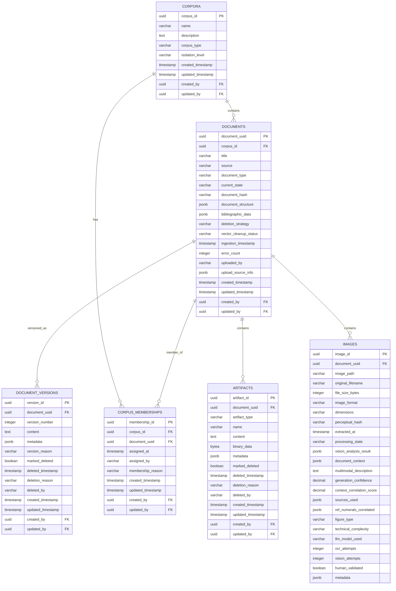

```mermaid 
%%{init: {"securityLevel":"loose"}}%%
erDiagram

    CORPORA {
        uuid corpus_id PK
        varchar name
        text description
        varchar corpus_type
        varchar isolation_level
        timestamp created_timestamp
        timestamp updated_timestamp
        uuid created_by FK
        uuid updated_by FK
    }

    DOCUMENTS {
        uuid document_uuid PK
        uuid corpus_id FK
        varchar title
        varchar source
        varchar document_type
        varchar current_state
        varchar document_hash
        jsonb document_structure
        jsonb bibliographic_data
        varchar deletion_strategy
        varchar vector_cleanup_status
        timestamp ingestion_timestamp
        integer error_count
        varchar uploaded_by
        jsonb upload_source_info
        timestamp created_timestamp
        timestamp updated_timestamp
        uuid created_by FK
        uuid updated_by FK
    }

    DOCUMENT_VERSIONS {
        uuid version_id PK
        uuid document_uuid FK
        integer version_number
        text content
        jsonb metadata
        varchar version_reason
        boolean marked_deleted
        timestamp deleted_timestamp
        varchar deletion_reason
        varchar deleted_by
        timestamp created_timestamp
        timestamp updated_timestamp
        uuid created_by FK
        uuid updated_by FK
    }

    CORPUS_MEMBERSHIPS {
        uuid membership_id PK
        uuid corpus_id FK
        uuid document_uuid FK
        timestamp assigned_at
        varchar assigned_by
        varchar membership_reason
        timestamp created_timestamp
        timestamp updated_timestamp
        uuid created_by FK
        uuid updated_by FK
    }

    ARTIFACTS {
        uuid artifact_id PK
        uuid document_uuid FK
        varchar artifact_type
        varchar name
        text content
        bytea binary_data
        jsonb metadata
        boolean marked_deleted
        timestamp deleted_timestamp
        varchar deletion_reason
        varchar deleted_by
        timestamp created_timestamp
        timestamp updated_timestamp
        uuid created_by FK
        uuid updated_by FK
    }

    IMAGES {
        uuid image_id PK
        uuid document_uuid FK
        varchar image_path
        varchar original_filename
        integer file_size_bytes
        varchar image_format
        varchar dimensions
        varchar perceptual_hash
        timestamp extracted_at
        varchar processing_state
        jsonb vision_analysis_result
        jsonb document_context
        text multimodal_description
        decimal generation_confidence
        decimal context_correlation_score
        jsonb sources_used
        jsonb ref_numerals_correlated
        varchar figure_type
        varchar technical_complexity
        varchar llm_model_used
        integer ocr_attempts
        integer vision_attempts
        boolean human_validated
        jsonb metadata
    }

    CORPORA ||--o{ DOCUMENTS : contains
    CORPORA ||--o{ CORPUS_MEMBERSHIPS : has
    DOCUMENTS ||--o{ DOCUMENT_VERSIONS : versioned_as
    DOCUMENTS ||--o{ CORPUS_MEMBERSHIPS : member_of
    DOCUMENTS ||--o{ ARTIFACTS : contains
    DOCUMENTS ||--o{ IMAGES : contains
```
