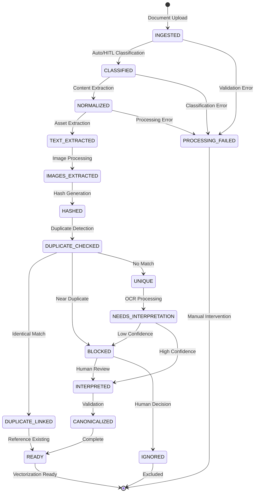

# Document Processing Pipeline Specification

**Status**: APPROVED - Consolidated Pipeline for P3.3-P3.4 Implementation (Jan 8, 2026)  
**Authority**: Technical implementation guidance for P3.3 Document Ingestion + P3.4 OCR Processing  
**Standards Compliance**: [Standards.md](../Standards.md) - MANDATORY common services usage, configuration patterns, and logging requirements  
**Cross-References**: [PipelineStateMachine.md](../PipelineStateMachine.md) (state transitions), [DataFlowDiagram.md](../DataFlowDiagram.md) (flow visualization), [DatabaseSchemaSpec.md](./DatabaseSchemaSpec.md) (persistence), [HITLTaskSpec.md](./HITLTaskSpec.md) (human review integration), [CorpusModel.md](../CorpusModel.md) (diagram corpus rules)

## Authority Relationship

**SystemNarrative.md defines WHAT** (document acquisition requirements and processing goals)  
**This specification defines HOW** (technical implementation of complete document → vector-ready pipeline)  
**PipelineStateMachine.md defines STATES** (document and image lifecycle transitions)  
**BuildPlan.md P3.3-P3.4 defines WHEN** (execution requirements and acceptance criteria)

## Purpose

Defines technical implementation of the complete document processing pipeline: acquisition, normalization, asset extraction, OCR processing, diagram classification, duplicate detection, and human-in-the-loop workflows for patent intelligence system.

## Pipeline Flow Diagram

### Summary State Flow

### Detailed Pipeline Flow

```mermaid
flowchart TD
    %% Document Intake Paths
    A[Manual Upload] --> B[Document Validation]
    C[Research Agent] --> D[Source Validation]
    B --> E[Raw Artifact Store]
    D --> E
    
    %% Registration & Classification
    E --> F[Document Registration]
    F --> G[INGESTED State]
    G --> H[Document Classification Agent]
    
    %% Classification Outcomes
    H --> I{Classification Confidence}
    I -->|High Confidence| J[CLASSIFIED State]
    I -->|Low Confidence| K[HITL Classification Task]
    K --> L[Human Review]
    L --> J
    
    %% Content Processing
    J --> M[Content Extraction]
    M --> N[Text Normalization]
    N --> O[NORMALIZED State]
    O --> P[Asset Extraction]
    P --> Q[TEXT_EXTRACTED State]
    
    %% Image Processing Pipeline
    Q --> R[Image Detection]
    R --> S[IMAGES_EXTRACTED State]
    S --> T[OCR Processing]
    T --> U[HASHED State]
    U --> V[Duplicate Detection]
    V --> W[DUPLICATE_CHECKED State]
    
    %% Duplicate Handling
    W --> X{Duplicate Status}
    X -->|Identical Match| Y[DUPLICATE_LINKED State]
    X -->|Near Duplicate| Z[BLOCKED State - HITL]
    X -->|Unique| AA[UNIQUE State]
    
    %% OCR & Interpretation
    AA --> BB[OCR Analysis]
    BB --> CC{OCR Confidence}
    CC -->|High Confidence| DD[NEEDS_INTERPRETATION State]
    CC -->|Low Confidence| EE[BLOCKED State - HITL]
    
    %% Human Review Workflows
    Z --> FF[Human Duplicate Review]
    EE --> GG[Human OCR Review]
    FF --> HH[Human Decision]
    GG --> HH
    
    %% Final Processing
    HH --> II{Human Judgment}
    II -->|Approve| DD
    II -->|Ignore| JJ[IGNORED State]
    DD --> KK[Diagram Classification]
    KK --> LL[INTERPRETED State]
    LL --> MM[Final Validation]
    MM --> NN[CANONICALIZED State]
    NN --> OO[READY State]
    
    %% Failure Paths
    B -->|Invalid Format| PP[PROCESSING_FAILED]
    D -->|Network Error| QQ[Retry Queue]
    QQ -->|Max Retries| PP
    H -->|Classification Error| PP
    T -->|OCR Failure| PP
    
    %% Terminal States
    Y --> RR[Available for Vectorization]
    OO --> RR
    JJ --> SS[Excluded from Processing]
    PP --> TT[Manual Intervention Required]
    
    %% State Styling
    classDef processState fill:#e1f5fe
    classDef decisionState fill:#fff3e0
    classDef hitlState fill:#fce4ec
    classDef terminalState fill:#e8f5e8
    classDef failureState fill:#ffebee
    
    class G,J,O,Q,S,U,W,Y,AA,DD,LL,NN,OO processState
    class I,X,CC,II decisionState
    class K,Z,EE,FF,GG hitlState
    class RR,SS terminalState
    class PP,TT failureState
```

## Required Content (Minimum Specification)

## Stage 1: Document Intake & Registration

### Document Intake Paths

#### Manual Upload Path
- **File Upload Interface**: HTML form with FastAPI backend
- **Supported Formats**: PDF, XML, HTML, images (PNG, JPG, TIFF)
- **File Validation**: Format verification, size limits, content integrity checks
- **Metadata Capture**: Source attribution, upload timestamp, user context
- **Error Handling**: Invalid formats, oversized files, corrupted uploads

#### Research Agent Path (Phase 3 Scope)
- **Manual Trigger Only**: No automated scheduling or background processing
- **Source Types**: USPTO database, Google Patents (API keys required)
- **Document Types**: Patents, Office Actions, IPR documents, prior art references, maintenance filings
- **Multi-Asset Acquisition**: Automatic discovery and download of associated images and figures
- **USPTO Integration**: Full metadata extraction including kind codes, bibliographic data
- **Validation Logic**: Source authenticity verification, duplicate detection
- **Rate Limiting**: API usage throttling to prevent service disruption
- **Output Triggers**: Successful acquisition triggers immediate Document Classification Agent processing

### Document Registration & Versioning

#### Registration Process
- **Document ID Generation**: UUID v4 for document identity
- **Source Type Assignment**: manual_upload | research_agent
- **Document Type Detection**: prosecution | maintenance | applications | patents | prior_art | ptab (base types)
- **USPTO Subtype Extraction**: Specific kind codes (OA, AANR, B1, A1, PET, etc.) when available
- **Classification Confidence**: Machine confidence scoring with HITL escalation thresholds
- **Classification Method Tracking**: "extracted" (from USPTO metadata) vs "determined" (LLM analysis)
- **Initial State Assignment**: INGESTED per PipelineStateMachine.md
- **Corpus Assignment**: Deferred to P3.5 Corpus Classification

#### Version Management
- **Immutable Storage**: Original document bytes preserved exactly
- **Version Tracking**: Sequential version numbers for document updates
- **Lineage Recording**: Parent-child relationships for document revisions
- **Audit Trail**: All registration events with timestamp and source attribution

## Stage 1.5: Document Classification & USPTO Analysis

### Classification Trigger
- **Automatic Trigger**: Successful document registration triggers Document Classification Agent
- **Input**: Raw document content + USPTO metadata from Research Agent or manual upload
- **Processing Priority**: High priority to enable rapid corpus assignment and pipeline routing

### USPTO Metadata Extraction
- **Kind Code Detection**: Extract USPTO kind codes from document headers and metadata
- **Bibliographic Analysis**: Parse USPTO publication data, application numbers, dates
- **Patent Family Identification**: Detect continuation, divisional, and related application relationships

### Classification Processing
- **Primary Method**: USPTO kind code mapping to base document types
- **Fallback Method**: LLM content analysis using patent domain knowledge
- **Confidence Scoring**: Generate classification confidence metrics (0.0-1.0 scale)
- **Subtype Determination**: Map USPTO codes to specific document subtypes

### HITL Escalation Logic
- **Confidence Thresholds**: Configurable per document type (default: prosecution=0.85, ptab=0.90, etc.)
- **Task Creation**: Generate classification review tasks for low-confidence classifications
- **Evidence Bundle**: Document content + classification attempts + similar document comparisons
- **Human Override**: Allow manual classification with audit trail per Standards.md requirements

### Pipeline Handoff
- **State Transition**: INGESTED → CLASSIFIED → NORMALIZED per PipelineStateMachine.md
- **Corpus Assignment**: Document type determines initial corpus routing per CorpusModel.md
- **Metadata Enrichment**: Classification data preserved in document_classification_metadata field

## Stage 2: Content Extraction & Normalization

### Content Extraction
- **PDF Processing**: Text extraction via PyPDF library, preserve original formatting
- **XML Processing**: Structure preservation, namespace handling, validation
- **HTML Processing**: Clean HTML parsing, link and reference extraction
- **Metadata Extraction**: Title, author, publication date, reference numbers

### Text Normalization
- **Encoding Standardization**: UTF-8 conversion with fallback handling
- **Whitespace Normalization**: Consistent line breaks, paragraph boundaries
- **Character Cleaning**: Remove control characters, preserve patent-specific formatting
- **Structure Preservation**: Section headers, claim numbering, figure references

### Asset Extraction
- **Image Detection**: Embedded images, figures, diagrams identification
- **Asset Storage**: Separate storage for binary assets with document linkage
- **Reference Mapping**: Figure numbers to image assets, caption extraction
- **Format Conversion**: Standardize image formats for downstream processing

### Pipeline Handoff to OCR Processing
- **State Transition**: INGESTED → NORMALIZED → TEXT_EXTRACTED per PipelineStateMachine.md
- **Asset Registry**: Complete catalog of extracted images for OCR processing
- **Metadata Handoff**: Document context and extracted captions passed to OCR stage

## Stage 3: OCR Processing & Image Analysis

### Image Extraction & Preparation
- **Source Detection**: Use images extracted in Stage 2 asset extraction
- **Format Standardization**: Convert to consistent format for OCR processing
- **Quality Assessment**: Resolution, contrast, clarity evaluation for OCR suitability
- **Preprocessing**: Noise reduction, contrast enhancement, rotation correction
- **Region Detection**: Text regions, diagram regions, decorative elements identification

### OCR Engine Integration
- **Primary Engine**: Tesseract OCR with language configuration (English + patent-specific)
- **Quality Scoring**: Confidence metrics for extracted text accuracy
- **Alternative Processing**: Fallback OCR strategies for low-confidence results
- **Character Recognition**: Patent-specific terminology and notation handling
- **Layout Preservation**: Spatial relationships between text elements

### Text Post-Processing
- **Confidence Filtering**: Low-confidence text flagged for human review
- **Patent Terminology**: Specialized vocabulary recognition and correction
- **Reference Extraction**: Figure numbers, claim references, part labels
- **Formatting Cleanup**: Whitespace normalization, line break handling
- **Quality Metrics**: Overall OCR success rate and confidence scoring

## Stage 4: Diagram Classification & Duplicate Detection

### Image Classification
- **Technical Diagrams**: Engineering drawings, flowcharts, system architectures
- **Decorative Elements**: Logos, borders, header/footer graphics
- **Non-Technical Images**: Photos, marketing materials, irrelevant graphics
- **Patent Drawings**: Formal patent figure drawings with reference numerals
- **Classification Confidence**: Automated classification with uncertainty handling

### Diagram Processing
- **Reference Numeral Extraction**: Identify and catalog part numbers and labels
- **Caption Association**: Link figure captions to corresponding diagrams
- **Spatial Analysis**: Component relationships and layout understanding
- **Technical Content Detection**: Distinguish technical vs decorative content
- **Complexity Assessment**: Diagram complexity for processing strategy selection

### Duplicate Detection & Canonicalization

#### Perceptual Hashing
- **Hash Generation**: Perceptual hashes for duplicate detection (pHash, dHash)
- **Similarity Thresholds**: Configurable thresholds for identical vs similar detection
- **Hash Storage**: Efficient hash storage and comparison infrastructure
- **Performance Optimization**: Fast similarity search across large diagram collections

#### Duplicate Resolution Strategies
- **Identical Matches**: Automatic linking to canonical diagram descriptions
- **Near Duplicates**: HITL escalation for human duplicate determination
- **Unique Diagrams**: New canonical description generation process
- **Cross-Document Duplicates**: Handle diagrams appearing in multiple documents

#### Canonical Description Management
- **Description Authority**: First-processed diagram establishes canonical description
- **Reuse Inheritance**: Subsequent identical diagrams inherit description and corpus constraints
- **Most Restrictive Rule**: Cross-corpus duplicates inherit most restrictive corpus limitations
- **Lineage Tracking**: Full provenance chain for all diagram reuse decisions

## Stage 5: Human-In-The-Loop Integration

### IGNORE Handling (Comprehensive)

#### IGNORE Decision Process
- **Automatic Classification**: Clear decorative/non-technical elements
- **Human Decision Required**: Ambiguous or potentially technical content
- **Required Rationale**: Human justification mandatory for IGNORE decisions
- **Administrative Override**: Project manager authority for IGNORE reclassification

#### IGNORED Diagram Storage
- **Full Preservation**: Complete diagram data and metadata retained
- **Audit Trail**: IGNORE decision with timestamp, rationale, human identity
- **Immutable Decisions**: IGNORE status cannot be silently changed
- **Lineage Maintenance**: IGNORED diagrams remain in provenance chains

#### Retrieval Exclusion Rules
- **Default Exclusion**: IGNORED diagrams excluded from normal retrieval operations
- **Explicit Inclusion**: Special queries may include IGNORED diagrams for audit
- **Evidence Preparation**: IGNORED diagrams never included in claim evidence bundles
- **Audit Visibility**: IGNORED diagrams visible in audit reports and lineage views

### HITL Escalation Framework

#### Escalation Triggers
- **Low OCR Confidence**: Text extraction confidence below threshold
- **Ambiguous Classification**: Uncertain technical vs decorative classification
- **Near Duplicate Uncertainty**: Similar but not identical diagrams requiring human judgment
- **Complex Technical Content**: Diagrams requiring domain expertise for interpretation

#### Evidence Bundle Assembly
- **Diagram Context**: Source document, page location, surrounding text
- **OCR Results**: Extracted text with confidence scores and alternatives
- **Classification Data**: Automated classification results with uncertainty metrics
- **Comparison Data**: Similar diagrams for duplicate determination context

#### Human Decision Integration
- **Task Creation**: Structured HITL tasks per HITLTaskSpec.md requirements
- **Decision Recording**: Human choices with rationale and timestamp
- **Quality Feedback**: Human corrections to improve automated processing
- **Escalation Routing**: Complex decisions to appropriate human reviewers

## Stage 6: State Transitions & Pipeline Completion

### Automatic Transitions (per PipelineStateMachine.md)
- **INGESTED → NORMALIZED**: Document text extraction complete
- **NORMALIZED → TEXT_EXTRACTED**: Text normalization complete
- **TEXT_EXTRACTED → IMAGES_EXTRACTED**: Asset extraction complete
- **IMAGE_EXTRACTED → HASHED**: Automatic perceptual hash generation
- **HASHED → DUPLICATE_CHECKED**: Automatic similarity comparison
- **DUPLICATE_CHECKED → DUPLICATE_LINKED**: Identical match found
- **DUPLICATE_CHECKED → UNIQUE**: No similar diagrams found
- **UNIQUE → NEEDS_INTERPRETATION**: Automatic OCR processing trigger

### HITL-Dependent Transitions
- **DUPLICATE_CHECKED → BLOCKED**: Near-duplicate requires human judgment
- **NEEDS_INTERPRETATION → BLOCKED**: Low OCR confidence or complex content
- **BLOCKED → INTERPRETED**: Human decision completes processing
- **INTERPRETED → CANONICALIZED**: Human approval of diagram description

### Terminal States
- **CANONICALIZED → READY**: Diagram available for downstream processing
- **PARTIALLY_PROCESSED → READY**: Document complete despite some failed images
- **ANY → IGNORED**: Human decision to exclude from processing
- **ANY → FAILED**: Irrecoverable processing errors

## Configuration & Thresholds

### Configurable Similarity Thresholds

#### Configuration-Driven Thresholds
- **Hash similarity thresholds** are configuration-driven via .env / BaseSettings, not hardcoded
- **Embedding similarity thresholds** are configuration-driven via .env / BaseSettings, not hardcoded
- **All threshold values** sourced from environment variables with validation
- **Runtime Configuration**: Thresholds loaded at application startup from Pydantic BaseSettings

#### Threshold Configuration Variables
- `DIAGRAM_HASH_THRESHOLD`: Perceptual hash similarity for identical detection
- `DIAGRAM_SIMILARITY_THRESHOLD`: Embedding similarity for near-duplicate detection
- `OCR_CONFIDENCE_THRESHOLD`: Minimum OCR confidence for text extraction
- **Default Values**: Reasonable defaults provided in configuration schema

### UI Visibility

#### Threshold Display and Control
- **Similarity threshold values are displayed in the UI** for human reviewer visibility
- **Threshold values are editable by the human reviewer** through configuration interface
- **Threshold changes are logged as configuration change audit events** with timestamp and rationale
- **Real-time Validation**: UI validates threshold changes before application

#### Configuration Change Audit
- **All threshold modifications** logged with human identity and timestamp
- **Rationale Required**: Human justification mandatory for threshold changes
- **Change History**: Complete audit trail of all threshold value changes
- **Rollback Capability**: Previous threshold values preserved for potential rollback

## Failure Handling & Recovery

### Document-Level Failures

#### Validation Failures
- **Format Rejection**: Unsupported or corrupted document formats
- **Size Limits**: Documents exceeding storage or processing limits
- **Content Validation**: Malformed or incomplete document content
- **Recovery Actions**: User notification, retry mechanisms, manual intervention

#### Processing Failures
- **Extraction Errors**: Text or metadata extraction failures
- **Normalization Issues**: Character encoding or formatting problems
- **Asset Failures**: Image extraction or processing errors
- **Graceful Degradation**: Partial processing with flagged failures

### Image-Level Failures

#### OCR Processing Failures
- **Engine Failures**: Tesseract processing errors or crashes
- **Quality Issues**: Unreadable or corrupted images
- **Timeout Handling**: Long-running OCR process management
- **Fallback Strategies**: Alternative processing approaches

#### Classification Failures
- **Ambiguous Content**: Images that cannot be reliably classified
- **Processing Errors**: Vision analysis failures
- **Threshold Uncertainties**: Content falling between classification boundaries
- **HITL Escalation**: Human review for unresolvable cases

### Partial Failure Handling

#### Idempotency

##### Document Duplicate Prevention
- **Document ingestion MUST be idempotent** - identical documents create single records
- **Identical document hashes resolve to the same document record** without duplication
- **Re-ingestion of identical documents does not create duplicates** but may update metadata

##### Hash Input Specification
- **Binary Content Hash**: SHA-256 of complete file binary content
- **Metadata Normalization**: Filename lowercased, whitespace normalized, timestamps excluded
- **Hash Input Formula**: `hash(binary_content + normalized_filename + file_size)`
- **Hash Collision Handling**: Secondary content comparison for hash matches

#### Mixed Success/Failure Scenarios
- **Text Extraction Success + Image Processing Failure**: Document persisted in PARTIAL state
- **Some Images Processed + Some Failed**: Successful artifacts preserved, failed flagged for retry
- **Metadata Success + Content Failure**: Basic document record created, content processing flagged

#### Partial State Management
- **PARTIAL State Documents**: Preserved with successful artifacts intact
- **Failed Artifact Tracking**: Individual artifact failures logged with retry capability
- **Progressive Completion**: Additional processing attempts build on existing successful artifacts
- **No Artifact Invalidation**: Partial failure does NOT invalidate previously successful artifacts

#### Recovery Strategies
- **Incremental Retry**: Retry only failed artifacts, preserve successful ones
- **HITL Escalation**: Complex partial failures escalated for human decision
- **State Progression**: PARTIAL documents can progress to READY when all artifacts complete
- **Audit Completeness**: All partial failure events logged with complete artifact inventory

## Provenance Integration

### Document Lineage
- **Source Attribution**: Complete source metadata and acquisition method
- **Processing History**: All normalization and extraction steps recorded
- **Asset Lineage**: Image extraction and processing provenance
- **Error Lineage**: Failed processing attempts with error details

### Audit Events
- **Registration Events**: Document intake with source and metadata
- **Processing Events**: Normalization steps with success/failure status
- **State Transitions**: All pipeline state changes with triggers
- **Access Events**: Document retrieval and viewing events

#### Enhanced Processing Audit
**Comprehensive audit coverage for advanced image processing pipeline per [DatabaseSchemaSpec.md](DatabaseSchemaSpec.md) requirements:**

**Required OCR Result Fields:**
- **`language`**: OCR language configuration (e.g., 'eng', 'eng+fra')
- **`engine_version`**: Tesseract version for processing traceability
- **`preprocessing_applied`**: JSON array of preprocessing steps applied

**Required Multimodal Description Fields:**
- **`context_correlation_score`**: Correlation between OCR and vision results
- **`sources_used`**: Array indicating which processing sources contributed
- **`reference_numerals_correlated`**: Patent figure reference numbers identified
- **`figure_type`**: Classification (system_architecture, flowchart, etc.)
- **`technical_complexity`**: Assessment level (low, medium, high)
- **`llm_model_used`**: LLM model identifier for description generation

**Note**: Complete vectorization JSON schemas are defined in [RAGInfrastructureSpec.md](RAGInfrastructureSpec.md).

## Design Decisions (APPROVED)

### Storage Architecture
- [x] **PostgreSQL Persistence**: All document and image metadata in relational database
- [x] **Binary Storage**: Original documents in filesystem with database references
- [x] **Asset Management**: Images stored separately with document linkage
- [x] **No External Services**: Local-only processing without external dependencies

### Processing Approach
- [x] **Synchronous Processing**: Direct processing without background queues
- [x] **Error Transparency**: All failures visible with clear error messages
- [x] **Manual Intervention**: Human oversight for failed processing
- [x] **Idempotent Operations**: Safe to retry processing without side effects

### OCR + Human Correction Approach
- [x] **No Full Automation**: All diagram descriptions require human validation
- [x] **OCR Assistance Only**: Automated text extraction supports human review
- [x] **Quality Thresholds**: Configurable confidence thresholds for escalation
- [x] **Human Authority**: Final diagram interpretation decisions are human-made

### Enforcement Rules
- **Changing thresholds does not retroactively alter prior canonicalization decisions** unless explicitly reprocessed
- **Historical Decisions**: Existing diagram relationships preserved with original threshold values
- **Threshold Adjustments**: Changes do not retroactively alter prior canonicalization decisions
- **Audit Trail Preservation**: Original decisions and threshold changes both logged

## Implementation Guidance

### FastAPI Integration
- Document upload endpoints with multipart/form-data support
- Validation middleware for file type and size checking
- Progress tracking for large document processing
- Error response formatting with user-friendly messages

### Configuration Architecture
- **All tunable values** (file size limits, timeout thresholds, retry counts) sourced from .env files
- **Loaded via Pydantic BaseSettings** with type validation and defaults
- **Configuration changes allowed by the single reviewer** through UI configuration interface
- **Configuration changes must be logged, timestamped, and attributed** per audit requirements
- **No runtime hardcoding of tunable values** - all limits and thresholds configurable

### Database Integration
- Document table with metadata fields and binary reference
- Asset table for image and figure storage references
- Processing history table for audit and troubleshooting
- Transaction boundaries for atomic document registration

### Tesseract Integration
- Tesseract installation and configuration for patent document processing
- Language model optimization for technical terminology
- Custom configuration for patent figure layouts and formatting
- Error handling for Tesseract processing failures

### Image Processing Pipeline
- PIL/Pillow for image manipulation and format conversion
- OpenCV integration for advanced image preprocessing
- Performance optimization for large diagram collections
- Memory management for high-resolution patent diagrams

### Database Schema Integration
- Diagram metadata tables with hash storage and comparison indices
- IGNORED diagram tracking with rationale and audit fields
- Canonical description linking with corpus constraint inheritance
- Performance indices for similarity search and duplicate detection

### Error Handling Patterns
- Exception hierarchy for different failure types
- Logging integration with structured error information
- User notification system for processing failures
- Administrative interface for failed document recovery

## Acceptance Criteria

### Document Ingestion (P3.3)
- [ ] Manual document upload through web interface functional
- [ ] Research agent document acquisition operational (manual trigger)
- [ ] PDF, XML, HTML document formats processed correctly
- [ ] Text extraction and normalization produce clean, structured output
- [ ] Images extracted and catalogued with document linkage
- [ ] Processing failures handled gracefully with user notification
- [ ] All document registration events logged with complete provenance
- [ ] Document versioning and lineage tracking operational

### OCR & Diagram Processing (P3.4)
- [ ] OCR processing extracts text from patent diagrams with quality scoring
- [ ] Perceptual hashing enables accurate duplicate detection across documents
- [ ] IGNORED diagrams stored with audit trail but excluded from retrieval
- [ ] Canonical diagram descriptions inherited correctly across duplicates
- [ ] Most restrictive corpus rule applied to cross-corpus duplicate diagrams
- [ ] HITL tasks generated for low-confidence OCR and near-duplicate resolution
- [ ] Human diagram decisions integrated with pipeline state transitions
- [ ] All diagram processing steps logged with complete provenance

### Pipeline Integration
- [ ] State transitions comply with PipelineStateMachine.md rules
- [ ] Complete document → vector-ready pipeline operational
- [ ] Partial failure handling preserves successful processing
- [ ] No background processing or external service dependencies
- [ ] Configuration-driven thresholds with UI visibility and audit
- [ ] No external OCR services or cloud processing dependencies

---

**Status**: SPECIFICATION COMPLETE - Ready for P3.3-P3.4 Implementation  
**Consolidated**: DocumentIngestionSpec.md + OCRAndDiagramSpec.md (Jan 8, 2026)  
**Approved**: Manual Upload Priority + OCR + Human Correction + Local Processing