# Enhancements

**Status**: PENDING EVALUATION - Advanced Capabilities for Phase 4+  
**Date**: January 9, 2026  
**Context**: Consolidated enhancements requiring evaluation and planning from January 9, 2026 discussions

## Enhanced Pipeline State Flow (All Enhancements Implemented)

```mermaid
stateDiagram-v2
    [*] --> UPLOADED : Multi-Format Upload
    UPLOADED --> FORMAT_VALIDATED : Word/HTML/PDF Support
    FORMAT_VALIDATED --> INGESTED : Document Registration
    
    %% Enhanced Classification with USPTO + Family Discovery
    INGESTED --> CLASSIFICATION_ANALYSIS : Enhanced Classification
    CLASSIFICATION_ANALYSIS --> USPTO_ANALYZED : Kind Code + Family Discovery
    USPTO_ANALYZED --> PATENT_FAMILY_MAPPED : Citation Network Analysis
    PATENT_FAMILY_MAPPED --> CLASSIFIED : Classification Complete
    
    %% Advanced Content Processing with Section Parsing
    CLASSIFIED --> CONTENT_EXTRACTED : Multi-Engine Extraction
    CONTENT_EXTRACTED --> SECTION_PARSED : Legal Document Structure
    SECTION_PARSED --> METADATA_ENRICHED : JSON Structure Metadata
    METADATA_ENRICHED --> NORMALIZED : Enhanced Normalization
    
    %% Enhanced Asset & Image Pipeline
    NORMALIZED --> ASSETS_EXTRACTED : Enhanced Asset Detection
    ASSETS_EXTRACTED --> TEXT_EXTRACTED : Text Processing Complete
    TEXT_EXTRACTED --> IMAGES_DETECTED : Advanced Image Discovery
    IMAGES_DETECTED --> IMAGES_EXTRACTED : Multi-Asset Processing
    
    %% Multimodal Image Analysis Pipeline
    IMAGES_EXTRACTED --> OCR_PROCESSED : Multi-OCR Engine
    OCR_PROCESSED --> VISION_ANALYZED : PyTorch Vision Analysis
    VISION_ANALYZED --> CONTEXT_EXTRACTED : Document Context Integration
    CONTEXT_EXTRACTED --> LLM_SYNTHESIZED : Multimodal LLM Synthesis
    LLM_SYNTHESIZED --> HASHED : Perceptual Hash Generation
    
    %% Enhanced Duplicate Detection
    HASHED --> SIMILARITY_CHECKED : Vector + Hash Similarity
    SIMILARITY_CHECKED --> FAMILY_DEDUPLICATED : Patent Family Deduplication
    FAMILY_DEDUPLICATED --> DUPLICATE_RESOLVED : Advanced Duplicate Resolution
    
    %% Branching Duplicate Outcomes
    DUPLICATE_RESOLVED --> DUPLICATE_LINKED : Exact Match Found
    DUPLICATE_RESOLVED --> NEEDS_REVIEW : Near Duplicate Detected
    DUPLICATE_RESOLVED --> UNIQUE_CONFIRMED : No Duplicates Found
    
    %% Enhanced HITL Workflows
    NEEDS_REVIEW --> HITL_QUEUED : Advanced Task Creation
    HITL_QUEUED --> HUMAN_REVIEWED : Enhanced UI Review
    HUMAN_REVIEWED --> HITL_RESOLVED : Human Decision
    HITL_RESOLVED --> APPROVED : Human Approval
    HITL_RESOLVED --> SOFT_DELETED : Human Rejection
    
    %% Main Processing Flow
    UNIQUE_CONFIRMED --> INTERPRETED : Auto-Interpretation
    APPROVED --> INTERPRETED : Post-HITL Processing
    INTERPRETED --> DIAGRAM_CLASSIFIED : Enhanced Classification
    DIAGRAM_CLASSIFIED --> CANONICALIZED : Validation Complete
    
    %% Enhanced Vector Lifecycle Management
    CANONICALIZED --> VECTOR_PREPARED : Vector Generation Ready
    VECTOR_PREPARED --> VECTOR_INDEXED : Vector Database Storage
    VECTOR_INDEXED --> READY : Available for RAG
    
    %% Advanced Lifecycle States
    READY --> VECTOR_OPTIMIZED : Background Optimization
    VECTOR_OPTIMIZED --> ARCHIVED : Long-term Storage
    ARCHIVED --> VECTOR_PRUNED : Cleanup Management
    
    %% Soft Delete and Version Management
    SOFT_DELETED --> VERSION_PRESERVED : Version History Maintained
    VERSION_PRESERVED --> AUDIT_RETAINED : Audit Trail Preservation
    
    %% Enhanced Failure Handling
    FORMAT_VALIDATED --> PROCESSING_FAILED : Validation Error
    CLASSIFICATION_ANALYSIS --> PROCESSING_FAILED : Classification Failure
    SECTION_PARSED --> PROCESSING_FAILED : Structure Parse Error
    OCR_PROCESSED --> NEEDS_REVIEW : Low OCR Confidence
    VISION_ANALYZED --> NEEDS_REVIEW : Low Vision Confidence
    
    %% Terminal States
    DUPLICATE_LINKED --> READY : Reference Processing
    READY --> [*] : Vector Database Ready
    AUDIT_RETAINED --> [*] : Soft Delete Complete
    VECTOR_PRUNED --> [*] : Lifecycle Complete
    PROCESSING_FAILED --> [*] : Manual Intervention
    
    %% Enhanced State Categories
    classDef uploadStates fill:#e3f2fd
    classDef classificationStates fill:#f3e5f5
    classDef processingStates fill:#e8f5e8
    classDef imageStates fill:#fff3e0
    classDef hitlStates fill:#fce4ec
    classDef vectorStates fill:#f1f8e9
    classDef lifecycleStates fill:#ede7f6
    classDef terminalStates fill:#e0f2f1
    
    class UPLOADED,FORMAT_VALIDATED,INGESTED uploadStates
    class CLASSIFICATION_ANALYSIS,USPTO_ANALYZED,PATENT_FAMILY_MAPPED,CLASSIFIED classificationStates
    class CONTENT_EXTRACTED,SECTION_PARSED,METADATA_ENRICHED,NORMALIZED processingStates
    class IMAGES_DETECTED,OCR_PROCESSED,VISION_ANALYZED,CONTEXT_EXTRACTED,LLM_SYNTHESIZED imageStates
    class NEEDS_REVIEW,HITL_QUEUED,HUMAN_REVIEWED,HITL_RESOLVED hitlStates
    class VECTOR_PREPARED,VECTOR_INDEXED,VECTOR_OPTIMIZED vectorStates
    class SOFT_DELETED,VERSION_PRESERVED,ARCHIVED,VECTOR_PRUNED lifecycleStates
    class READY terminalStates
```

## Phase 4+ Enhancement Candidates

### 1. Multimodal Image Description System
**Source**: 2026-01-06PipelineEnhancements.md - Enhancement 1  
**Scope**: 4-stage processing pipeline (OCR → Vision Analysis → Context Extraction → LLM Synthesis)  
**Effort**: ~4-5 days implementation  
**Value**: Superior patent diagram descriptions for better claim generation  
**Dependencies**: PyTorch Vision Models, Document Context Parser, Enhanced LLM Agent  
**Decision Required**: Include in Phase 4 or defer to later phases

### 2. Legal Document Section Parsing System  
**Source**: 2026-01-06PipelineEnhancements.md - Enhancement 2  
**Scope**: Patent structure recognition, section-aware parsing, JSON metadata extraction  
**Effort**: ~4-5 days implementation  
**Value**: Structured document analysis for targeted claim generation  
**Dependencies**: Document structure templates, section classification models  
**Decision Required**: Include in Phase 4 or defer to later phases

### 3. Vector Database Cleanup Management
**Source**: 2026-01-06PipelineEnhancements.md - Enhancement 3  
**Scope**: Three-tier cleanup strategy (immediate, filtered, archived)  
**Effort**: ~4-5 days implementation  
**Value**: Comprehensive document lifecycle management  
**Dependencies**: Vector storage architecture, cleanup policies  
**Decision Required**: Include in Phase 4 or defer to later phases

### 4. Enhanced Document Lifecycle Management
**Source**: NewStateMachine.md  
**Scope**: Advanced state management, soft delete architecture, version preservation, multi-OCR support  
**Effort**: ~5-7 days implementation  
**Value**: Sophisticated document management with user control  
**Dependencies**: Extended state machine, cascade delete logic  
**Decision Required**: Include in Phase 4 or defer to later phases

### 5. Pipeline Gap Remediation
**Source**: 01-09-pipeline-review.md - Remaining gaps  
**Scope**: Manual image addition UI, missing asset handling, advanced HITL workflows  
**Effort**: ~3-4 days implementation  
**Value**: Complete user workflow support  
**Dependencies**: UI enhancements, HITL task system expansion  
**Decision Required**: Include in Phase 3 completion or defer to Phase 4

### 6. Advanced Document Format Support
**Source**: January 9, 2026 discussion - Document pipeline workflows  
**Scope**: Word document processing, HTML with embedded image handling, complex format normalization  
**Effort**: ~2-3 days implementation  
**Value**: Broader document support for diverse patent sources  
**Dependencies**: Additional parsing libraries, format-specific handlers  
**Decision Required**: Include in Phase 4 or defer based on user needs

### 7. Research Agent Intelligence Enhancements
**Source**: January 9, 2026 discussion - Agent acquisition capabilities  
**Scope**: Patent family discovery, citation network analysis, related document identification  
**Effort**: ~4-5 days implementation  
**Value**: Comprehensive patent research beyond individual documents  
**Dependencies**: USPTO API extensions, graph analysis algorithms  
**Decision Required**: Include in Phase 4 or defer to later phases

### 8. User Interface Document Management
**Source**: January 9, 2026 discussion - Pipeline workflows  
**Scope**: Document preview, batch operations, search and filter UI, corpus management interface  
**Effort**: ~3-4 days implementation  
**Value**: Complete user experience for document management  
**Dependencies**: React components, document preview capabilities  
**Decision Required**: Include in Phase 4 or prioritize based on user workflow needs

## Recommendation

These enhancements represent significant advanced capabilities beyond the core P3.1-P3.12 foundation. Recommend:

1. **Complete P3.1-P3.12 foundation first** (basic document processing, classification, storage)
2. **Evaluate these enhancements for Phase 4+** once core system is operational
3. **Prioritize based on user feedback** from core system usage
4. **Consider 2-3 enhancements per phase** to maintain manageable scope

## Discussion Items from January 9, 2026

### Implemented During Discussion (✅ COMPLETED)
- **Hybrid USPTO Classification System**: Base document types + specific USPTO kind codes with confidence scoring
- **Research Agent Multi-Asset Acquisition**: USPTO figure download and multi-document acquisition capabilities
- **Document Classification Agent**: New agent with patent domain expertise and HITL integration
- **HITL Classification Review**: Configurable confidence thresholds with human review workflows

### Identified But Deferred for Future Evaluation
- **Manual Image Upload to Existing Documents**: UI workflow for completing documents with missing images
- **Complex Document Structure Recognition**: Patent-specific section parsing beyond basic text extraction
- **Advanced Vector Database Operations**: Lifecycle management, cleanup strategies, optimization
- **Enhanced State Management**: Soft deletes, version preservation, reprocessing workflows

## Next Steps Required

- [ ] User decision on enhancement priorities
- [ ] Phase 4 planning and timeline
- [ ] Resource allocation for advanced capabilities
- [ ] Integration planning with core system