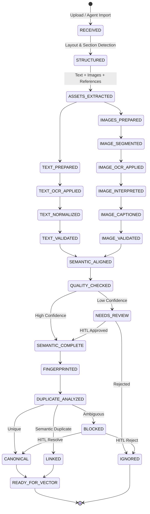

## Tables Needed
Tables
⦁	Corpus – Top-level isolation and scoping boundary for all data, agents, and vectors.
⦁	Document – Source artifact metadata and lifecycle container within a corpus.
⦁	Section – Stable structural units detected from layout and refined before semantic freeze.
⦁	TextBlock – Ordered, single-role textual units (body, formula, list, caption, footnote, endnote) belonging to sections.
⦁	Image – First-class visual assets extracted from documents and anchored to sections.
⦁	Table – Structured tabular containers preserving document location and headers.
⦁	TableRow – Row-level semantic units of tables used for validation and vectorization.
⦁	Embedding – Vector representations linked to finalized TextBlocks, TableRows, or Images and scoped by corpus.
⦁	AssetStatus – Processing state, disposition, and confidence tracking for all assets across pipeline stages.
⦁	HITLReview – Human-in-the-loop decisions, overrides, and audit trail for assets and structure.
⦁	ProcessingJob – Pipeline execution tracking, retries, failures, and rebuild coordination.

⦁	Chunk – Synthetic or composite text units created for chunking (may reference multiple TextBlocks/TableRows).
⦁	Embedding – Vector representations linked to TextBlocks, TableRows, Images, or Chunks (model, versioned, rebuildable).

## Dataflow Diagram

```mermaid
stateDiagram-v2
    [*] --> RECEIVED

    RECEIVED : Upload / Agent Import
    RECEIVED : creates -> Corpus (if needed)
    RECEIVED : creates -> Document
    RECEIVED : initializes -> AssetStatus, ProcessingJob

    RECEIVED --> STRUCTURED

    STRUCTURED : Layout & Section Detection
    STRUCTURED : creates -> Section (provisional)
    STRUCTURED : updates -> Document metadata
    STRUCTURED : updates -> AssetStatus

    STRUCTURED --> ASSETS_EXTRACTED

    ASSETS_EXTRACTED : Raw Asset Discovery
    ASSETS_EXTRACTED : creates -> TextBlock (raw / empty or native)
    ASSETS_EXTRACTED : creates -> Image (binary + metadata)
    ASSETS_EXTRACTED : creates -> Table (container only)
    ASSETS_EXTRACTED : updates -> AssetStatus

    ASSETS_EXTRACTED --> TEXT_PREPARED
    ASSETS_EXTRACTED --> IMAGE_PREPARED

    TEXT_PREPARED : Text Preparation
    TEXT_PREPARED : updates -> TextBlock (content if native)
    TEXT_PREPARED : flags -> TextBlock (OCR required)
    TEXT_PREPARED : updates -> AssetStatus

    TEXT_PREPARED --> TEXT_OCR_APPLIED

    TEXT_OCR_APPLIED : OCR Text Extraction
    TEXT_OCR_APPLIED : updates -> TextBlock.content
    TEXT_OCR_APPLIED : updates -> TextBlock.confidence
    TEXT_OCR_APPLIED : updates -> AssetStatus

    TEXT_OCR_APPLIED --> TEXT_NORMALIZED

    TEXT_NORMALIZED : Text Normalization & Role Assignment
    TEXT_NORMALIZED : updates -> TextBlock.role
    TEXT_NORMALIZED : updates -> TextBlock.content (cleaned)
    TEXT_NORMALIZED : creates -> TableRow (from Tables)
    TEXT_NORMALIZED : updates -> AssetStatus

    TEXT_NORMALIZED --> TEXT_VALIDATED

    TEXT_VALIDATED : Text Validation
    TEXT_VALIDATED : updates -> TextBlock.confidence
    TEXT_VALIDATED : updates -> AssetStatus

    IMAGE_PREPARED : Image Preparation
    IMAGE_PREPARED : updates -> Image (segmentation metadata)
    IMAGE_PREPARED : updates -> AssetStatus

    IMAGE_PREPARED --> IMAGE_OCR_APPLIED

    IMAGE_OCR_APPLIED : Image OCR / Diagram Text
    IMAGE_OCR_APPLIED : updates -> Image (OCR text)
    IMAGE_OCR_APPLIED : updates -> AssetStatus

    IMAGE_OCR_APPLIED --> IMAGE_INTERPRETED

    IMAGE_INTERPRETED : Image Understanding
    IMAGE_INTERPRETED : updates -> Image (semantic description)
    IMAGE_INTERPRETED : updates -> AssetStatus

    IMAGE_INTERPRETED --> IMAGE_VALIDATED

    IMAGE_VALIDATED : Image Validation
    IMAGE_VALIDATED : updates -> Image.confidence
    IMAGE_VALIDATED : updates -> AssetStatus

    TEXT_VALIDATED --> STRUCTURE_REFINED
    IMAGE_VALIDATED --> STRUCTURE_REFINED

    STRUCTURE_REFINED : Section Refinement & Finalization
    STRUCTURE_REFINED : splits / relabels -> Section
    STRUCTURE_REFINED : reassigns -> TextBlock, Image, Table
    STRUCTURE_REFINED : marks -> Section.finalized
    STRUCTURE_REFINED : updates -> AssetStatus

    STRUCTURE_REFINED --> SEMANTIC_COMPLETE

    SEMANTIC_COMPLETE : Semantics Frozen
    SEMANTIC_COMPLETE : marks -> TextBlock.finalized
    SEMANTIC_COMPLETE : marks -> Image.finalized
    SEMANTIC_COMPLETE : marks -> Table / TableRow.finalized
    SEMANTIC_COMPLETE : updates -> AssetStatus

    SEMANTIC_COMPLETE --> CHUNKED

    CHUNKED : Chunk Construction
    CHUNKED : creates -> Chunk
    CHUNKED : references -> TextBlock, TableRow, Image
    CHUNKED : updates -> AssetStatus

    CHUNKED --> VECTORIZED

    VECTORIZED : Vector Embedding
    VECTORIZED : creates -> Embedding
    VECTORIZED : references -> Chunk or Source Asset
    VECTORIZED : updates -> AssetStatus

    VECTORIZED --> READY

    READY : Corpus Ready for Retrieval
    READY : stable -> Core Tables
    READY : disposable -> Chunk, Embedding

    READY --> [*]

```

## State Diagram

